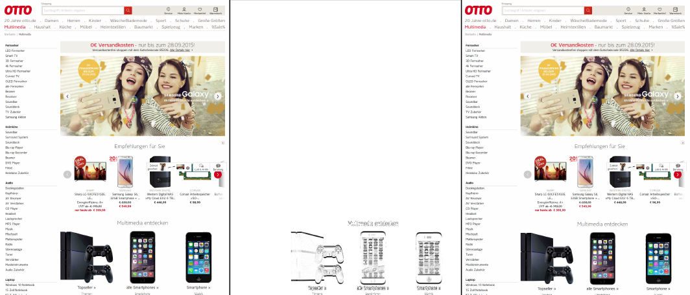

# Lineup

Lineup is doing automated testing of webpage designs, eg. in continious delivery.
If you push new code to production, you can evaluate the design of your page compared to a defined base design and
get an analysis about the difference of the designs:

For all images that you want to compare, you will receive information about how many pixel are different
between the two image version and an image, that contains only the parts, that changed, a "difference image".


Picture: Example view of base (left), new (right) as well as diff image. In this example, the margin around the bottom headline increased,
thus some of the elements moved down.

## Requirements

A firefox browser must be installed, as well as phantomjs.

## Usage

Add it into your Gemfile:
````ruby
gem "lineup"
````

Or install it manually with the following command:
````
gem install lineup
````

Do a base reference screenshot of you application:
````ruby
require 'lineup'
lineup = Lineup::Screenshot.new('https://www.otto.de')
lineup.record_screenshot('base')
````

Do something (deployment of your new code) and take a new screenshot
````ruby
lineup.record_screenshot('new')
````

Analyse the results:
````ruby
lineup.compare('new', 'base')
 => [{:url => 'sport', :width => 600, :difference => 0.7340442722738748,
    :base_file => '/home/name/lineup/screenshots/base_frontpage_600.png'
    :new_file =>  '/home/name/lineup/screenshots/new_frontpage_600.png'
    :diff_file => '/home/name/lineup/screenshots/DIFFERENCE_frontpage_600.png' }]
````

You can save it for later use:
````ruby
lineup.save_json('/home/name/lineup/results/')
 => '/home/name/lineup/results/log.json'
````

## More configuration:

There are multiple ways to specify what to lineup and compare.

By specifying different urls via ````#urls````:
````ruby
lineup = Lineup::Screenshot.new('https://www.otto.de')
lineup.urls('/, /multimedia, /sport')
````
This will do analysis of otto.de root (frontpage), otto.de/multimedia and otto.de/sport.
It requires a comma separated string. Default value is only root.

By specifying different resolutions via ````#resolutions````:
````ruby    
lineup = Lineup::Screenshot.new('https://www.otto.de')
lineup.resolutions('600, 800, 1200')
````
The values are the browser width in pixel. For each size an analysis is done.
It require a comma separated string. Default values are 640px, 800px and 1180px.

By specifying a wait time for asychron elements on a page via ````#wait_for_asynchron_pages````:
````ruby
lineup = Lineup::Screenshot.new('https://www.otto.de')
lineup.wait_for_asynchron_pages(5)
````
The wait time is the time in seconds lineup will wait after the page load before it takes a screenshot.
In this time third party tools, AJAX or js as well as fonts can be (lazy) loaded. The wait time has no upper limit.

By specifying a filepath for the screenshots via ````#filepath_for_images````:
````ruby    
lineup = Lineup::Screenshot.new('https://www.otto.de')
lineup.filepath_for_images('/home/myname/lineup/screenshots')
````
Creates a file and saves the screenshots in the file. Default is ````"#{Dir.pwd}/screenshots"````

By specifying a filepath for the difference image via ````#difference_path````:
````ruby    
lineup = Lineup::Screenshot.new('https://www.otto.de')
lineup.difference_path('/home/myname/lineup/result')
````
Creates a file and saves the difference image in the file. Default is ````"#{Dir.pwd}/screenshots"````

By specifying wether or not to use phantomjs via ````#use_phantomjs````:
````ruby    
lineup = Lineup::Screenshot.new('https://www.otto.de')
lineup.use_phantomjs(true)
````
If ````false```` the screenshots are taken in Firefox. ````#load_json_config````:

Load all above configs from a json file via 
````ruby    
lineup = Lineup::Screenshot.new('https://www.otto.de')
lineup.load_json_config('/home/myname/lineup/config.json')
````
While my file contains all relevant information
````json
{
  "urls":"/multimedia, /sport",
  "resolutions":"600,800,1200",
  "filepath_for_images":"~/images/",
  "use_phantomjs":true,
  "difference_path":"#/images/diff",
  "wait_for_asynchron_pages":5
}
````
However, if the configuration is done with a json object, it needs to contain all information, there
is no optional parameter.

## Example:

````ruby  
base_name = 'name-for-base-screenshot'
new_name = 'name-for-new-screenshot'
urls = '/, multimedia, sport'
resolutions = '600, 800, 1200'
images_path = '/home/myname/lineup/screenshots'
difference_path = '/home/myname/lineup/results'
json_path = 'home/myname/lineup/results'
phantomjs = true

lineup = Lineup::Screenshot.new('https://www.otto.de')
lineup.urls(urls)
lineup.resolutions(resolutions)
lineup.filepath_for_images(images_path
lineup.difference_path(difference_path)
lineup.use_phantomjs(phantomjs)
    
lineup.record_screenshot(base_name)
# do sth. (eg. deploy new software)
lineup.record_screenshot(new_name)
lineup.save_json(json_path)
````
Now open home/myname/lineup/results and find:
the difference files and a log.json with all information about what images are not the same.

## Contribute

Please do!
 
